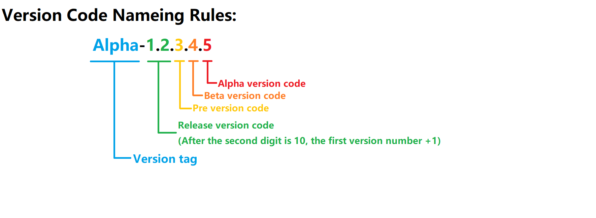

# AgentCLI
A Super Agent
# 注意
**必须安装pydantic库和requests库**
## 安装命令
> pydantic库
> ```
> pip install pydantic
> ```
> requests库
> ```
> pip install requests
> ```
# 帮助
在`AGENT`界面使用;;exit命令退出AgentCLI，使用;;config命令打开配置界面
# 更新日志
## Beta-1.1.2.2
- ## 更新
  - 1.统一解析MCP，为未来对插件的支持做铺垫
- ## 未来
  - [ ] 添加对mcp插件(plugin)的支持，允许添加自定义的mcp工具
  - [ ] 将powershell做成mcp模块，让有需求的用户可以使用
  - [ ] 为其制作TUI，使其类似opencode
  - [ ] 对历史记录的持久化存储在未来以session的形式回归
## Beta-1.1.2.1
- ## 更新
  - 1.规范化返回响应的函数
- ## 未来
  - [ ] 添加对mcp插件(plugin)的支持，允许添加自定义的mcp工具
  - [ ] 将powershell做成mcp模块，让有需求的用户可以使用
  - [ ] 为其制作TUI，使其类似opencode
  - [ ] 对历史记录的持久化存储在未来以session的形式回归
## Pre-release-1.1.2
- ## 更新
  - 1.移除了`config`里的`save_history`和`send_saved_history`字段以及对应的功能
  - 2.`prompt_file`字段改为`prompt`，提示词统一存放在`prompt`文件夹里面
  - 3.更详细的帮助文档
- ## 未来
  - [ ] 添加对mcp插件(plugin)的支持，允许添加自定义的mcp工具
  - [ ] 将powershell做成mcp模块，让有需求的用户可以使用
  - [ ] 为其制作TUI，使其类似opencode
  - [ ] 对历史记录的持久化存储在未来以session的形式回归
## Pre-release-1.1.1
- ## 更新
  - 1.移除了MCP协议里的`id`字段
  - 2.将`module`和`method`字段合并为单一的`method`字段，采用`module.method.function`三级格式
  - 3.system模块参数的键改为`command`，不再使用`command1`
- ## 未来
  - [ ] 添加对mcp插件(plugin)和模块(module)的支持，允许添加自定义的mcp工具
  - [ ] 将powershell做成mcp模块，让有需求的用户可以使用
  - [ ] 添加note模块，允许ai自行记录ai自己的笔记
  - [ ] 添加memory模块，允许ai记录自己的记忆并以系统提示词的方式在聊天时发送给ai
  - [ ] 添加library模块，允许ai自行查找技能教程并学习，类似skill
- ## 注意
  - 1.plugin是在mcp工具被调用后运行
  - 2.module是始终接收mcp请求
## Release-1.1.0
- ## 更新
  - 1.把system模块里的run方法改为terminal，cmd和shell合并为run函数
  - 2.彻底抛弃powershell
  - 3.添加python模块，允许Agent执行python代码
  - 4.删除了log_commands配置，改为logger里的lite选项
  - 5.修改了日志格式，日志标识从`[日志]`改为`[模块名@方法名:函数]`的格式，类似之前的cmcp或linux的命令提示符
  - 6.在config模式添加了`help`命令，使用help查看所有config命令说明，添加`cfghelp`命令，查看所有配置项用途
- ## 未来
  - [ ] 允许自己编写mcp模块
  - [ ] 将powershell做成mcp模块，让有需求的用户可以使用
## Release-1.0.0
- ## 更新
  - 1.彻底修改mcp协议，抛弃了原来的cmcp协议，改用更标准的mcp协议
  - 2.可以自动修改错误的配置项，config不会允许用户将配置项修改错误
  - 3.没有配置时自动创建默认配置
- ## 未来
  - [ ] 允许自己编写mcp模块
  - [ ] 允许让ai执行python
# 版本号规则

